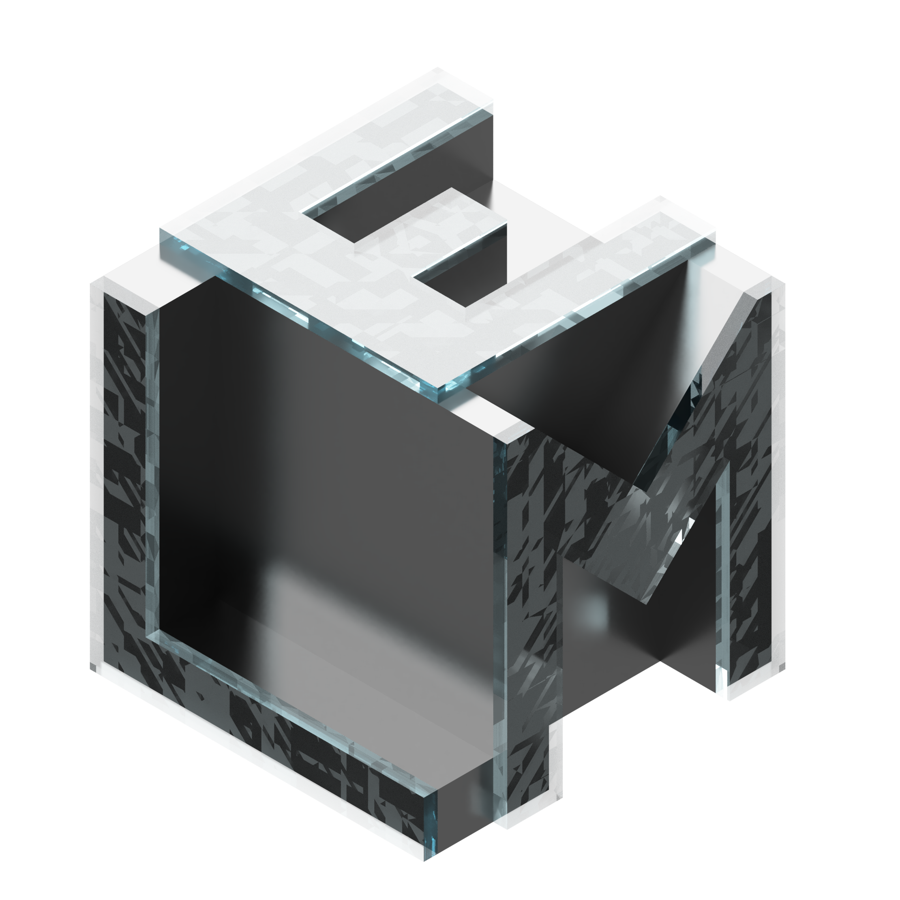
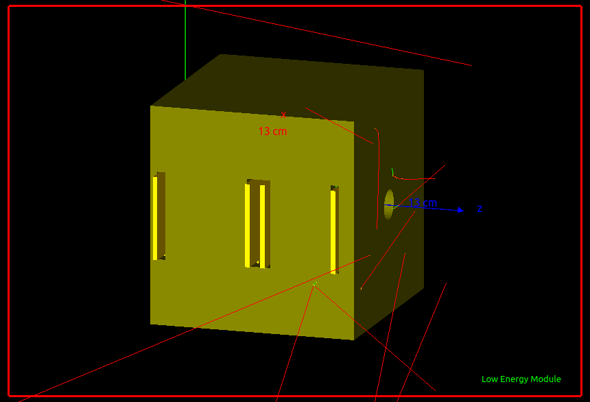

# Low Energy Module (LEM): Upgrade with geometry from CAD file


 


## Brief description
This repository contains the source code for the Geant4 simulation of the Low Energy Module, a submodule fo the Zire` detector onboard teh NUSES platform.





This simulation is inherited by the Geant4 example **G04** [Link to the G04 example](https://gitlab.cern.ch/geant4/geant4/-/tree/v11.1.1/examples/extended/persistency/gdml/G04).


## Softwares adopted
Here the list of softwares and tools I used for the realisation of this repository:
1. Fusion 360 by AutoDesk for the implementation of a plausible geometry of the LEM 
2. The geometry was then exported into a .step file. To open the .step file and for the generation of the GDML file I used FreeCAD 


3. The FreeCAD workbench was then used for the assignment of the materials to all of the volumes within the geometry. It can be installed via the **Addon Manager**. See the linked repository on Github https://github.com/KeithSloan/GDML 


## Link and resources

- Geant4 website https://geant4.web.cern.ch/
- Geant4 example G04 repository GitLab https://gitlab.cern.ch/geant4/geant4/-/tree/v11.1.1/examples/extended/persistency/gdml/G04
- GDML Documentation https://gdml.web.cern.ch/GDML/
- FreeCAD website https://www.freecad.org/
- FreeCAD GDML workbench https://github.com/KeithSloan/GDML
- Fusion 360 software https://www.autodesk.it/


## FreeCAD GDML Workbench commands
Here some useful commands for the utilization of the FreeCAD  Python console with the GDML workbench 
- ` FreeCAD.getDocument('Unnamed').getObject('GDMLBox_WorldBox').material = u"G4_Galactic"` : Assegnazione del materiale G4_Galactic al volume worldVol
- `Gui.activateWorkbench("GDML_Workbench")` : Command for the activation of the Workbench GDML

1. `Gui.runCommand('BoxCommand',0)` : Command for the creation of a G4Box for the world volume 
2. `Gui.Selection.addSelection('Unnamed','LV_Box')` : Select the part containing the world volume
3. `Gui.Selection.addSelection('Unnamed','LV_Box','GDMLBox_Box.')` Select the GDML Box object under the respective part
4. `FreeCAD.getDocument('Unnamed').getObject('GDMLBox_Box').material = u"G4_Galactic"` : Change the material of the G4Box
5. `FreeCAD.getDocument('Unnamed').getObject('LV_Box').Label = "worldVol"` : rename the object label
6. `Gui.activeView().setActiveObject('part', App.activeDocument().Part)` Generate a part inside the document
7. Change the link between the parts. Move the created part under the world volume part
```
App.getDocument('Unnamed').getObject('Part').adjustRelativeLinks(App.getDocument('Unnamed').getObject('LV_Box'))

App.getDocument("Unnamed").getObject("LV_Box").addObject(App.getDocument("Unnamed").getObject("Part"))
```
8. `FreeCAD.getDocument('Unnamed').getObject('Part').Label = "LEM_Assembly"` Rename the part under the world volume to "LEM_Assembly". Here we have to put the solids from the step file


## Run the simulation
### With visualization

For running the simulation with the visualization use the bash script **simulationVis.sh**.
The commands in this script are listed below. The executable file is named **gdml_det**. 
It is **MANDATORY** to give an argument to the executable which is the path to the **GDML** file containing the description of the detector.

```
cd ./build
cmake ..
make
./gdml_det LowEnergyVolume_WorldVolume.gdml
cd ..
```


## Detector concept

The detector is designed in the following way. From the external to the internal part there are:
- An aluminium mask formin a collimator. The Aluminium layer is 0.8 cm thick
- An active Veto made of plastic scintillator EJ-200 1 cm thick
- A first Silicon layer $100 \ \mu m$ thick. This is the $\Delta E$ layer in which only a small fraction of the energy is deposited. This amount of energy is sometimes called Linear Energy Transfer (LET). This because  
$$
\Delta E \approx \biggl| - \frac{1}{\rho} \frac{dE}{dx} \biggr| \rho_{Si} \times \Delta x
$$
- Then, a second layer made of Silicon with larger thickness is the layer in which the particle has to stop. The simulation has the setting to change this thickness and also to select another option of the material which is the CZT, a denser material.
- An active veto, made of plastic scintillator Ej-200 is then positioned on the back. If a particle is too energetic, it reaches the veto which wiull trigger ignoring that event.
- Additional plastic scintillator layers are added to extend te observed energy window to higher energies

The detector is based on the $\Delta E - E$ technique. This simulation is aimed at characterising the energy deposition inside the materials using the correct geometry of the instrument. 

## Directory structure

At the moment, the directory structure is the following

```
.
├── build
│   ├── auxiliary.gdml
│   ├── CMakeCache.txt
│   ├── CMakeFiles
│   │   ├── 3.22.1
│   │   │   ├── CMakeCCompiler.cmake
│   │   │   ├── CMakeCXXCompiler.cmake
│   │   │   ├── CMakeDetermineCompilerABI_C.bin
│   │   │   ├── CMakeDetermineCompilerABI_CXX.bin
│   │   │   ├── CMakeSystem.cmake
│   │   │   ├── CompilerIdC
│   │   │   │   ├── a.out
│   │   │   │   ├── CMakeCCompilerId.c
│   │   │   │   └── tmp
│   │   │   └── CompilerIdCXX
│   │   │       ├── a.out
│   │   │       ├── CMakeCXXCompilerId.cpp
│   │   │       └── tmp
│   │   ├── cmake.check_cache
│   │   ├── CMakeDirectoryInformation.cmake
│   │   ├── CMakeOutput.log
│   │   ├── CMakeRuleHashes.txt
│   │   ├── CMakeTmp
│   │   ├── G04.dir
│   │   │   ├── build.make
│   │   │   ├── cmake_clean.cmake
│   │   │   ├── compiler_depend.make
│   │   │   ├── compiler_depend.ts
│   │   │   ├── DependInfo.cmake
│   │   │   └── progress.make
│   │   ├── gdml_det.dir
│   │   │   ├── build.make
│   │   │   ├── cmake_clean.cmake
│   │   │   ├── compiler_depend.internal
│   │   │   ├── compiler_depend.make
│   │   │   ├── compiler_depend.ts
│   │   │   ├── DependInfo.cmake
│   │   │   ├── depend.make
│   │   │   ├── flags.make
│   │   │   ├── gdml_det.cc.o
│   │   │   ├── gdml_det.cc.o.d
│   │   │   ├── link.txt
│   │   │   ├── progress.make
│   │   │   └── src
│   │   │       ├── G04ActionInitialization.cc.o
│   │   │       ├── G04ActionInitialization.cc.o.d
│   │   │       ├── G04DetectorConstruction.cc.o
│   │   │       ├── G04DetectorConstruction.cc.o.d
│   │   │       ├── G04EventAction.cc.o
│   │   │       ├── G04EventAction.cc.o.d
│   │   │       ├── G04HitClass.cc.o
│   │   │       ├── G04HitClass.cc.o.d
│   │   │       ├── G04PrimaryGeneratorAction.cc.o
│   │   │       ├── G04PrimaryGeneratorAction.cc.o.d
│   │   │       ├── G04RunAction.cc.o
│   │   │       ├── G04RunAction.cc.o.d
│   │   │       ├── G04SensitiveDetector.cc.o
│   │   │       ├── G04SensitiveDetector.cc.o.d
│   │   │       ├── G04TrackingAction.cc.o
│   │   │       └── G04TrackingAction.cc.o.d
│   │   ├── Makefile2
│   │   ├── Makefile.cmake
│   │   ├── progress.marks
│   │   └── TargetDirectories.txt
│   ├── cmake_install.cmake
│   ├── defaultSetting.mac
│   ├── g04.mac
│   ├── G4History.macro
│   ├── gdml_det
│   ├── init_vis.mac
│   ├── LowEnergyVolume_WorldVolume.gdml
│   ├── Makefile
│   └── vis.mac
├── CMakeLists.txt
├── docs
│   ├── G4Logo.png
│   └── LEM_logo.PNG
├── gdml_det.cc
├── GdmlFiles
│   ├── auxiliary.gdml
│   └── LowEnergyVolume_WorldVolume.gdml
├── GNUmakefile
├── History
├── include
│   ├── G04ActionInitialization.hh
│   ├── G04DetectorConstruction.hh
│   ├── G04EventAction.hh
│   ├── G04HitClass.hh
│   ├── G04PrimaryGeneratorAction.hh
│   ├── G04RunAction.hh
│   ├── G04SensitiveDetector.hh
│   └── G04TrackingAction.hh
├── macro
│   ├── defaultSetting.mac
│   ├── g04.mac
│   ├── init_vis.mac
│   └── vis.mac
├── OutputText
│   ├── GDML_AuxiliaryInfo.txt
│   ├── GDML_MaterialInfo.txt
│   └── GDML_SolidNames.txt
├── README
├── simulationVis.sh
└── src
    ├── G04ActionInitialization.cc
    ├── G04DetectorConstruction.cc
    ├── G04EventAction.cc
    ├── G04HitClass.cc
    ├── G04PrimaryGeneratorAction.cc
    ├── G04RunAction.cc
    ├── G04SensitiveDetector.cc
    └── G04TrackingAction.cc

17 directories, 95 files
```


## Doxygen documentation
Doxygen documentation is available in the `Docs` folder. To generate it, run the following command in the main directory

```
doxygen Doxyfile
```
To generate the pdf you need to add to the preamble of the `refman.tex` file the following line
```
\usepackage{pmboxdraw}
```
This is needed to correctly display the tree structure of the classes. Then run the following commands
```
make 
```
